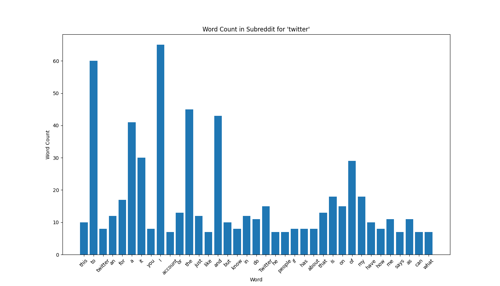
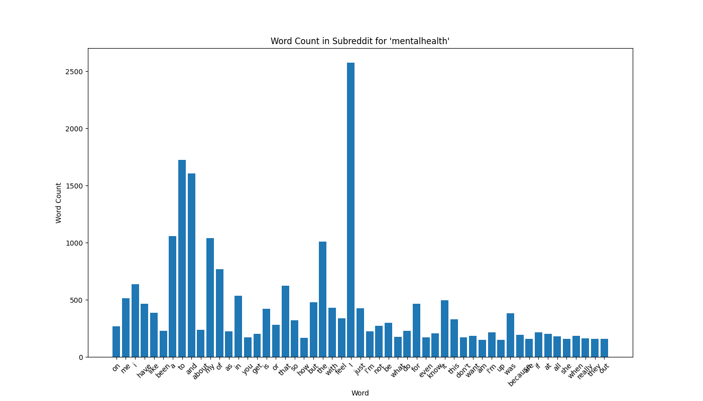

	For this project, I used the PRAW reddit API Library to pull data from various subreddits and do both sentiment analysis and a histogram for word count. Generally, I started all the data analytics by creating a for loop to loop through the titles and descriptions of the top posts in each subreddit. For each title and description, I created methods to return them as both a dictionary and as a list. I wanted to learn about dataframes so I converted the dictionaries into dataframes to try and manipulate data that way. Then within these dictionaries and dataframes, manipulating the data within these data structures, I managed to produce sentiment analysis and a graph to measure top used words.

	After setting up the data sources as dictionaries and lists, next up was how to manipulate data to achieve the intended result. Eg, for the dictionary, to build a dataframe, I had to add all the data in a way such that the dictionary had a title, and all the information in it. I got lucky because for each title, there was a description of some sort, which means I didn’t have to deal with differing dictionary lengths to graph in the future. Then, after using techniques we learned in class to count the number of words for each word, I filtered the data so that only a certain portion of the imformation was graphed out. Then finally by manipulating the graph using functions that I found from online documentation, I got to the graph that I’m attaching below. 

	For the Lists data, I turned it into sentiment analysis to see generally how positive or negative people felt in those subreddits. By adding all the data to a list, than looping through the list, I could access each individual title and description. With access to each of these, I could use the sentiment analysis functions that were provided to us to give us a general sentiment from the ‘compound’ key. Then by accessing this, and creating a new list, I could loop through and average all the values to come up with a final sentiment.

	For the dictionary list, by using the dataframes and the graphs, I was able to observe the most spoken words looking at the graphs. Looking at the data, I was both surprised and not surprised that ‘I’ was the most commonly spoken word, especially since reddit is a place to share your own personal thoughts and opinions. I think it was expected that people use the word twitter a lot in the twitter subreddit since reddit is a place to share opinions, but the words mental health were not used at all in the mental health subreddit. I think this could suggest that there is some stigma against those words, or that people are less inclined to share their thoughts and feelings under the guise of mental health. 

	For the sentiment analysis, I ended up with an average compounded score to tell overall to see how people were feeling in each subreddit. Wall street bets had a 0.25, Mental health had -0.21, ‘happy’ had 0.66, league of legends had 0.39, and basketball had a 0.14. I think these numbers were suprising but also expected. For a subreddit named happy, generally feelsgood stories and thoughts were shared where people would share positive things in their life. On the other hand, in mental health, I’m sure that people were generally feeling down and that’s the primary reason why they were posting. Amusingly league of legends players seem to generally be happier and more positive than basketball, suggesting that maybe while the online community is toxic over the internet, they are a less toxic community that basketball players.

My greatest constraint for this project was trying to self-learn matplotlib and pandas. At the end of the day, I was unable to sort the data since time constraints. I’m glad I learned them and have a vague idea about how they work however, since I could see them being extremely helpful in the future. My code was very unorganized, and I didn’t have that many code descriptors which I will work on the future. Furthermore, as I was editing my code, I noticed that many of my variable’s names were named poorly and clearly meant in a short-term stance.

 
 

	

	
